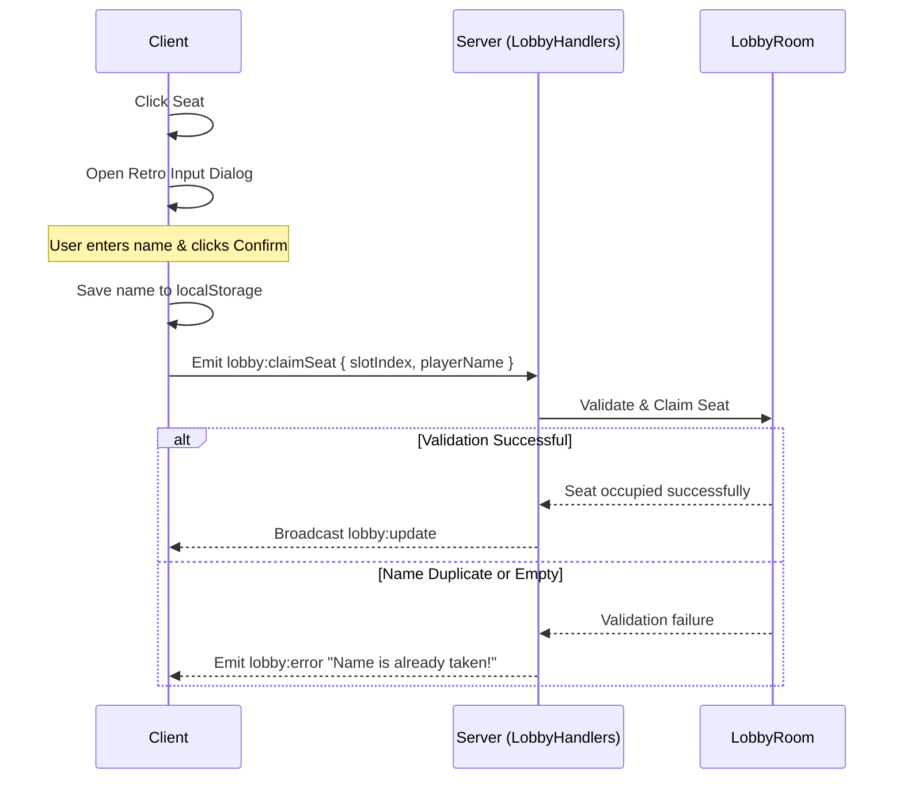

# Design Document: Player Custom Names

## Overview
Allows players to customize their name when claiming a seat in the lobby. The name is persisted in local storage, validated on the server for uniqueness and formatting, and displayed across the lobby, chat, and active gameplay HUD interfaces.

---

## 1. Requirements

### Client/UX
- When a player clicks an "AVAILABLE" seat in the lobby, a custom retro-styled modal dialog prompts them to enter their name.
- The input is pre-filled with the name in `localStorage` under the key `'titan_nexus_player_name'` (or a generated default like `Pilot_<random>` if empty).
- The input limits name length to 15 characters.
- The custom name is saved to `localStorage` upon confirmation and sent to the server.
- To change their name, players can leave their seat and re-claim it.

### Server
- The `LobbyRoom` slots store the `playerName`.
- On `lobby:claimSeat`, the server validates the custom name:
  - Must not be empty or purely whitespace.
  - Length must not exceed 15 characters.
  - Must be unique (case-insensitively) among all occupied seats in the lobby room.
- If validation fails, the server emits a `lobby:error` socket event to the client and rejects the claim.
- Chat messages map the sender socket/token to their custom player name.
- Upon starting a match, the names are fed into the `GameState` instance.

---

## 2. Technical Architecture & Data Flows

### File Changes
1. **`server/LobbyRoom.js`**:
   - Update `slots` data structure to include `playerName`.
   - Update `claimSeat(slotIndex, token, socketId, playerName)` to store the name and perform uniqueness validation.
2. **`server/sockets/LobbyHandlers.js`**:
   - Modify the `lobby:claimSeat` and `lobby:autoJoin` socket listeners to parse `playerName`.
3. **`server/sockets/ChatHandlers.js`**:
   - Resolve sender names using seat slot data or game state names rather than hardcoded Player 1/Player 2 values.
4. **`server/index.js`**:
   - Extract player names from slots during `startMatch()` and pass them to `context.game.initializeGame`.
5. **`shared/GameState.js`**:
   - Extend `initializeGame` to receive and initialize the player name dictionary.
6. **`client/src/hooks/useGameSocket.js`**:
   - Modify `handleClaimSeat` to accept the player name and pass it to socket event.
7. **`client/src/components/LobbyOverlay.jsx`**:
   - Add retro modal component for name input.
   - Render custom names instead of `Player {index + 1}`.
8. **`client/src/components/HUD/SidebarLeft.jsx` & `SidebarRight.jsx`**:
   - Display the player's custom name in the left panel badge.
   - Display player status dots dynamically with custom name tooltips and two-letter abbreviations.

---

## 3. Approval

This design has been reviewed and approved by the user.

- **Status**: APPROVED
- **Date**: 2026-07-03
