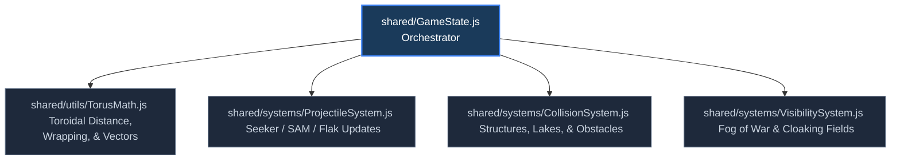
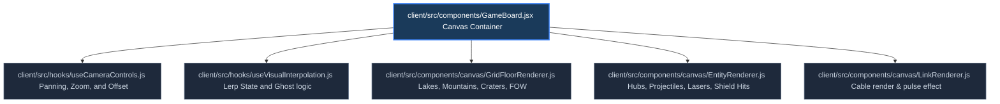

# Refactoring Candidates & Modularization Blueprint

This analysis outlines the primary files within the **Titan: Nexus Command** codebase that exhibit characteristics of "spaghetti code"—specifically high coupling, massive file sizes, and multiple violations of the Single Responsibility Principle (SRP).

Below is a curated roadmap identifying these candidates, their current architectural pain points, and a modular architecture design to clean up the code.

---

## 📊 Summary of Candidates

| File                                                                                         | Current Size               | Primary Issues                                                                                                                        | Recommended Modularization Target                                                                     |
| :------------------------------------------------------------------------------------------- | :------------------------- | :------------------------------------------------------------------------------------------------------------------------------------ | :---------------------------------------------------------------------------------------------------- |
| [GameState.js](file:///home/behalr/titan-nexus-command/shared/GameState.js)                  | **122.4 KB** (2,733 lines) | Violates SRP. Mixes core game loop state, complex toroidal geometry, projectile search logic, and collision handling.                 | Extract into Toroidal Math helpers, System packages, and a pure GameState Orchestrator.               |
| [GameBoard.jsx](file:///home/behalr/titan-nexus-command/client/src/components/GameBoard.jsx) | **101.8 KB** (1,984 lines) | Mixes UI state (camera, mouse, panning), client-side physics interpolation (Lerp), and thousands of lines of canvas drawing code.     | Extract into separate sub-renderers (Grid, Entities, Links, UI overlays) and camera/lerp React hooks. |
| [App.jsx](file:///home/behalr/titan-nexus-command/client/src/App.jsx)                        | **36.5 KB** (898 lines)    | Combines socket.io connection logic, local HUD/UI component layout, CRT shader config, session auth, and volume/sound controls.       | Extract into a `useGameSocket` hook, distinct HUD subcomponents, and custom UI contexts.              |
| [server/index.js](file:///home/behalr/titan-nexus-command/server/index.js)                   | **17.9 KB** (498 lines)    | Orchestrates Express/HTTP server setup, global network latency configurations, client validation logic, turn timers, and lobby rules. | Extract into separate Lobby/Game socket router files and a standalone tick/timer service.             |

---

## 🔍 Deep-Dive Analysis of Candidates

---

### 1. GameState.js (The Headless Engine)

- **Location:** [shared/GameState.js](file:///home/behalr/titan-nexus-command/shared/GameState.js)

#### ⚠️ Pain Points:

- **The "God Class" Antipattern:** The `GameState` class acts as the single source of truth but also functions as the math engine, physics simulator, and collision resolver.
- **Complex Nested Simulation Logic:** Functions like `updateSeekerProjectile` (around line 772) and `resolveTurn` are massive and hard to test in isolation due to their deep dependencies on internal state.
- **Duplicate Helpers:** Math helpers like `getToroidalDistance` are duplicated or implemented slightly differently in front-end renderers compared to this file.

#### 🛠️ Refactoring Blueprint:

- **Proposed Files:**
    1. `shared/utils/TorusMath.js`: Houses pure functions for distance, vectors, wrapping, and intersection equations.
    2. `shared/systems/ProjectileSystem.js`: Contains seeker targeting and trajectory updates.
    3. `shared/systems/CollisionSystem.js`: Handles simultaneous landing overlap (Rule A), crashing on existing structures (Rule B), and lake/mountain/crater boundaries.
    4. `shared/systems/VisibilitySystem.js`: Contains player circular vision, specialized projectile cones, and cloaking field algorithms.

---

### 2. GameBoard.jsx (The Canvas Renderer)

- **Location:** [client/src/components/GameBoard.jsx](file:///home/behalr/titan-nexus-command/client/src/components/GameBoard.jsx)

#### ⚠️ Pain Points:

- **Massive Drawing Subsystems:** The rendering loop (`updateAndDraw` at line 167) is almost 1,000 lines long, rendering everything in a giant procedural cycle.
- **Camera / Pointer Coupling:** Panning, pinching-to-zoom, and mouse coordinate conversions are mixed directly with Canvas logic, making UI updates highly prone to regressions.
- **Manual Interpolation (Lerp):** Managing local visual visual states (ghosting, spawn visual effects, and sound triggers) is handled within the React component ref lifecycle.

#### 🛠️ Refactoring Blueprint:

- **Proposed Files:**
    1. `client/src/hooks/useCameraControls.js`: React hook to handle pointer inputs, zoom limits, and wheel-at-cursor coordinates.
    2. `client/src/hooks/useVisualInterpolation.js`: Hook managing the `visualEntities` and `visualLinks` interpolation buffers (lerp lifecycle).
    3. `client/src/components/canvas/`:
        - `GridFloorRenderer.js`: Standard tiled background and static terrain hazards (Lakes, Mountains, Craters, Fog of War overlay).
        - `EntityRenderer.js`: Draw routines for active nodes, shields, and weapons.
        - `LinkRenderer.js`: Decoupled links renderer with directional pulse dashes.

---

### 3. App.jsx (The Main Interface Router)

- **Location:** [client/src/App.jsx](file:///home/behalr/titan-nexus-command/client/src/App.jsx)

#### ⚠️ Pain Points:

- **Overloaded State:** Houses lobby management, socket listeners, and HUD state simultaneously.
- **Direct Component Layout:** Layout variables (`sidebarLeft`, `sidebarRight`) are constructed inline and render inline, cluttering the main logic block.
- **Acoustics Integration:** Global volume and track selector rendering is tightly coupled to socket state and the chiptune player.

#### 🛠️ Refactoring Blueprint:

- **Extract custom hook `useGameSocket`:**
    - Handles Socket.io connection events, turn timer loops, game state updates, pilot seating, map save triggers, and errors setup.
- **Componentize HUD Layout:**
    - Move sidebars into `./components/HUD/SidebarLeft.jsx` and `./components/HUD/SidebarRight.jsx`.
    - Keep the core [App.jsx](file:///home/behalr/titan-nexus-command/client/src/App.jsx) as a simple router component.

---

### 4. server/index.js (Network Hub & Simulation Core)

- **Location:** [server/index.js](file:///home/behalr/titan-nexus-command/server/index.js)

#### ⚠️ Pain Points:

- **Express & Socket Bleeding:** Express routing, Socket.io connection state, authentication, and manual turn delays are managed in one file.
- **Lack of Route Splitting:** Player action processing and lobby status adjustments are handled procedurally inside the global `connection` callback.

#### 🛠️ Refactoring Blueprint:

- **Modularize Sockets:**
    - Move lobby seat selection, player ready flags, and map options out of `index.js` and into a new `server/sockets/lobbyHandlers.js`.
    - Move action submissions, pass turn events, and client syncs into a new `server/sockets/gameHandlers.js`.
- **Separate Tick Service:**
    - Extract the turn resolution timer loop (`startTimer`, `tick`, `resolveTurn`) into a specialized timer scheduler.

---

## 🚀 Refactoring Strategy & Next Steps

To prevent breaking existing multiplayer systems, refactoring should be carried out incrementally:

1. **Step 1: Extract Math & Constants**
    - Move coordinate translations and toroidal math equations out of `GameState.js` into `TorusMath.js`. Validate utilizing existing test suites (`AudioManager.test.js`, etc.).
2. **Step 2: Componentize App.jsx Sidebars**
    - Relocate visual UI layouts (Sidebars) to separate React components. This yields immediate code readability gains without affecting network logic.
3. **Step 3: Decouple GameBoard Hooks**
    - Separate pointer panning/zooming controls into `useCameraControls.js`.
4. **Step 4: Refactor GameState Mechanics**
    - Extract collision loops and projectile trackers into modular systems.
